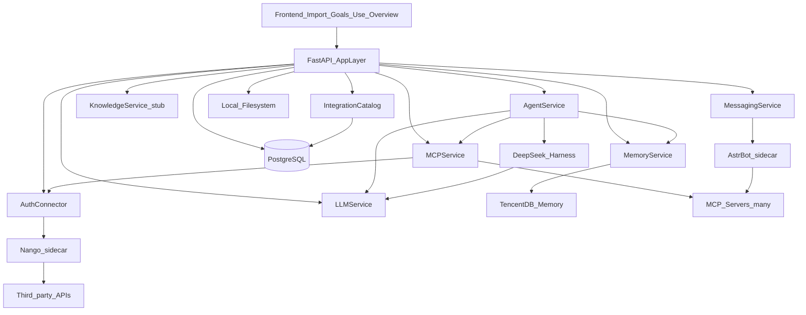

# Architecture

Self-hosted single-customer product. Modular FastAPI monolith + sidecars. Four UI pages; collaboration is out of scope.

Canonical 5-day plan: [plan.md](../plan.md).

## Role split

| Component | Product role | Access path |
|-----------|----------------|-------------|
| DeepSeek Harness | Primary agent runtime (Goals / Use / tool runs) | `AgentService` |
| AstrBot | Messaging / IM connectors (Telegram, Discord, …) | `MessagingService` |
| Nango + MCP Manager | OAuth/API scale + catalog/registry/gateway | `AuthConnector` + `MCPService` |
| TencentDB Agent Memory | Long-term / fact memory | `MemoryService` |
| PostgreSQL | App state (Dev1) | services + models |
| DeepSeek LLM | Shared model access | `LLMService` |

**Hard rule:** `API → AgentService → DeepSeek Harness`. AstrBot is not a second Goals/Use brain. Harness does not own Telegram/Discord stacks.

## Layout

```
frontend/                 V2.3.2 mock SPA (design contract, not DB schema)
backend/                  FastAPI + adapters
docs/                     Contracts, licenses, cursor guides
docker-compose.yml        api + postgres + memory + harness + astrbot + nango
```

## Request flow



## Frontend pages → API (HTTP surface)

| Route | Modules | Owner |
|-------|---------|--------|
| `#/overview` | `overview.py` | Dev1 |
| `#/goals` | `goals.py`, `tasks.py` | Dev1 |
| `#/import-data` | `sources.py`, `integrations.py` | Dev1 HTTP; Dev2 AuthConnector/MCP |
| `#/use-data` | `agents.py`, `memories.py`, `messaging.py` | Dev2 services |

Prototype layouts must not become hard DB/API constraints.

## Dev ports

| Service | Port |
|---------|------|
| Frontend | 3000 |
| API | 8000 |
| Postgres | 5432 |
| Nango / nango-mock | 3003 |
| MCP gateway (in-process Day 5; optional sidecar) | 8080 |
| Memory (TencentDB or stub) | 8081 |
| DeepSeek Harness | 8082 |
| AstrBot | 8083 |

## Sprint phases (5-day vertical slice)

1. Contracts + Compose skeleton (mock sidecars OK).
2. CRUD (Dev1) + sidecar boots (Dev2).
3. Connect path + AgentService → Harness.
4. AstrBot one platform + bulk MCP register.
5. Smoke demo + freeze open packaging decisions.
