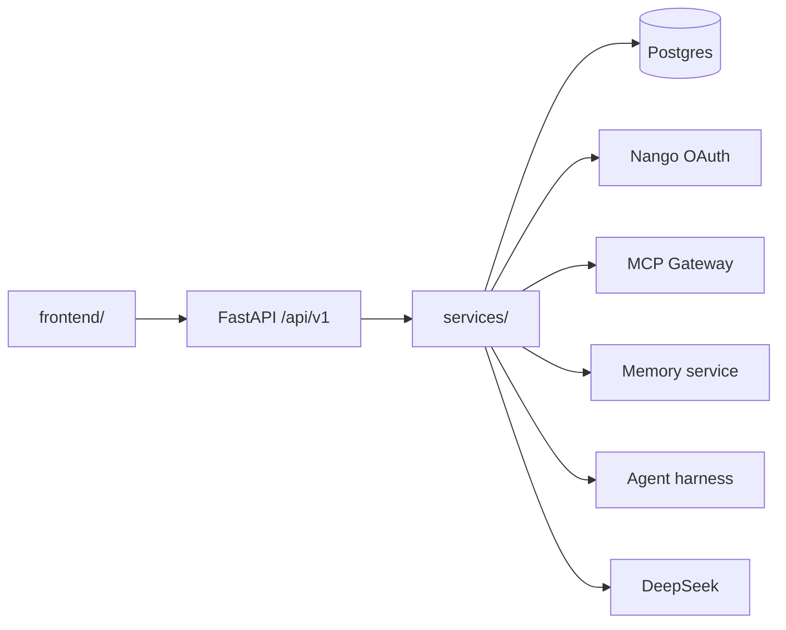

# Architecture

Monorepo for the Weeple AI OS dashboard and API.

## Layout

```
frontend/                 Browser UI (hash router, modular pages)
backend/                  FastAPI API + adapters
docs/                     Contracts and dev guides
docker-compose.yml        Local stack (api, postgres, adapters)
```

## Request flow



## Frontend pages → API

| Route | Modules |
|-------|---------|
| `#/overview` | `overview.py` |
| `#/goals` | `goals.py`, `tasks.py` |
| `#/import-data` | `sources.py`, `integrations.py` |
| `#/use-data` | `agents.py`, `memories.py`, `messaging.py` |

## Phases

1. **Mock API** — `USE_MOCK_DATA=true`, seed data matches V2.3.2 UI mocks.
2. **Persistence** — Postgres models + Alembic; frontend repositories call API.
3. **Adapters** — Nango connect, MCP catalog, agent harness, memory service.

## Dev ports

| Service | Port |
|---------|------|
| Frontend (`npx serve frontend`) | 3000 |
| API | 8000 |
| Postgres | 5432 |
| Nango (stub) | 3003 |
