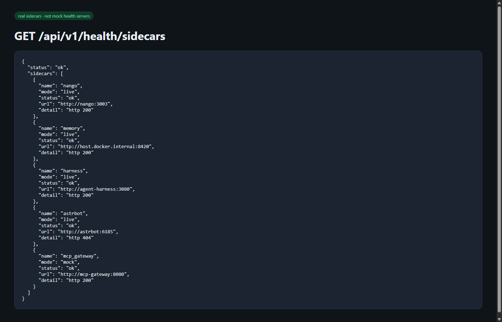

# Real sidecar stack (not mock health servers)

**Date:** 2026-08-18  
**Owner:** Developer 2  
**Status:** Running locally

## What shipped

Official images/repos wired into `docker-compose.yml`. FastAPI `GET /api/v1/health/sidecars` pings **those processes**, not the old Python mock `/health` servers.

| Service | Source | Evidence |
|---------|--------|----------|
| TencentDB Agent Memory | `agentmemory/memory-core` already on this machine as `tdai-memory-core` ([TencentCloud/TencentDB-Agent-Memory](https://github.com/TencentCloud/TencentDB-Agent-Memory)) | `GET http://localhost:8420/health` → `"status":"ok"` |
| Memory Hub / Knowledge | `tdai-memory-hub` | `:8125` panel, `:8424/health` |
| Nango | `nangohq/nango-server:hosted` ([NangoHQ/nango](https://github.com/NangoHQ/nango)) | `GET http://localhost:3003` → HTTP 200 |
| DeepSeek Harness | `@deepseek-ai/dsh web` ([deepseek-ai/deepseek-harness](https://github.com/deepseek-ai/deepseek-harness)) | `GET http://localhost:3080` → Harness Web UI HTML |
| AstrBot | `soulter/astrbot:latest` | WebUI `http://localhost:6185` |
| DeepSeek LLM | `api.deepseek.com` / `deepseek-v4-pro` | unchanged (only cloud API) |

Compose does **not** start a second Memory Core (port 8420 is already used by `tdai-memory-core`). Profile `owned-memory` starts our copies if that stack is absent.

## How we verified

```powershell
docker compose --env-file backend/.env up -d --build
curl http://localhost:8420/health
curl http://localhost:3003
curl http://localhost:3080
cd backend
python scripts/ping_real_sidecars.py
curl http://localhost:8000/api/v1/health/sidecars
pytest -q
```

| Check | Result |
|-------|--------|
| `ping_real_sidecars.py` | `SIDECARS ok` |
| API sidecar board | `"status":"ok"` (AstrBot `/health` is 404; WebUI is up) |
| pytest | **24 passed** (unit tests stay offline) |

## Demo



- Memory Core: http://localhost:8420/health  
- Memory Hub: http://localhost:8125  
- Nango: http://localhost:3003  
- Harness UI: http://localhost:3080  
- AstrBot WebUI: http://localhost:6185  

Change the AstrBot dashboard password after first login (see container logs; do not commit it).
