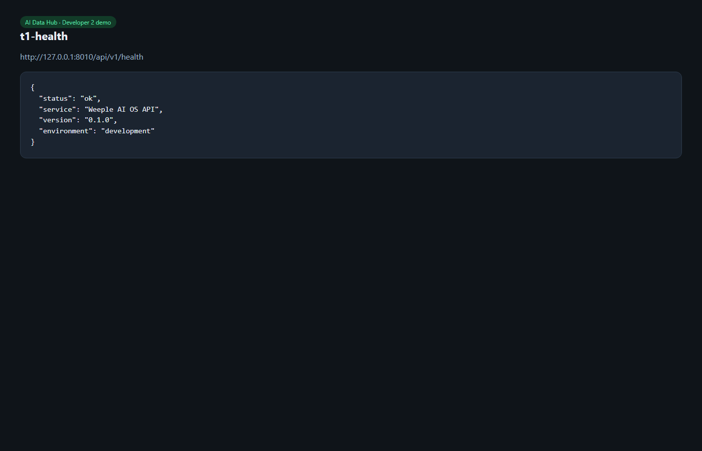
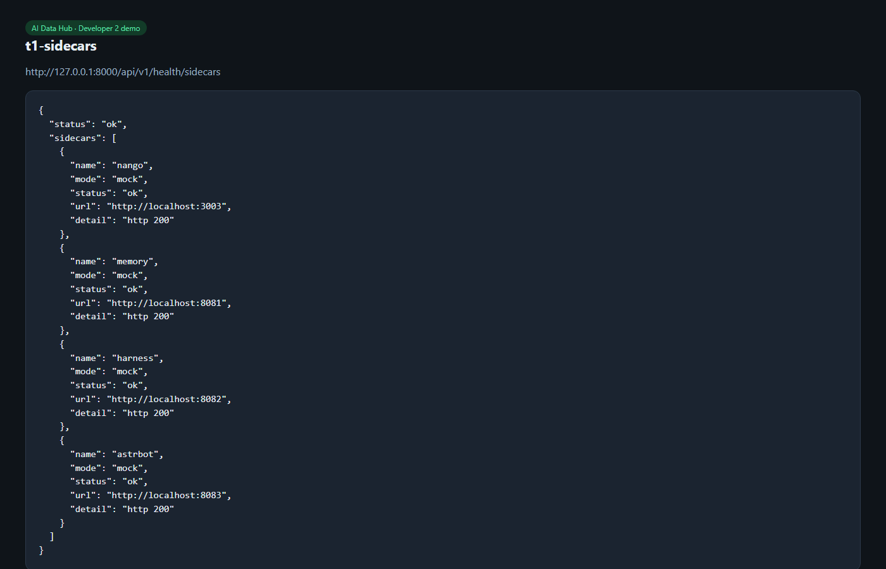
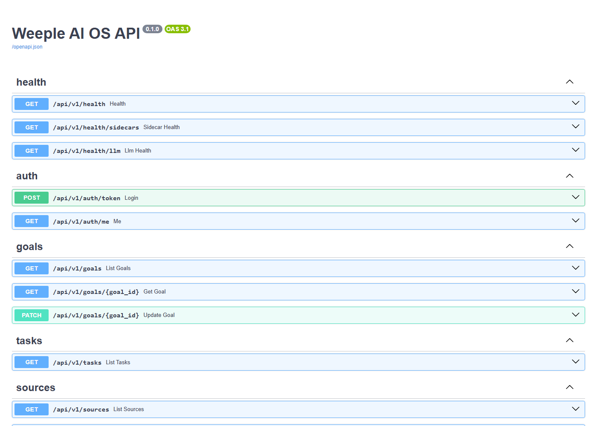

# T1 — Sidecar Compose + health

**Date:** 2026-08-18  
**Owner:** Developer 2  
**Status:** Done

## What shipped

Mock JSON `/health` sidecars in Compose (Harness, AstrBot, Nango, Memory, MCP gateway) and `GET /api/v1/health/sidecars` through `SidecarHealthService`. Routers do not call sidecar URLs directly. Nginx placeholders removed.

## How we verified

```powershell
docker compose up --build -d
curl http://localhost:8000/api/v1/health
curl http://localhost:8000/api/v1/health/sidecars
cd backend; pytest -q
```

Result: all listed sidecars `status: ok`, `mode: mock`. Pytest green.

## Demo

App health:



Sidecar board:



OpenAPI (`/docs`):



## URLs

- http://localhost:8000/api/v1/health
- http://localhost:8000/api/v1/health/sidecars
- http://localhost:8000/docs
