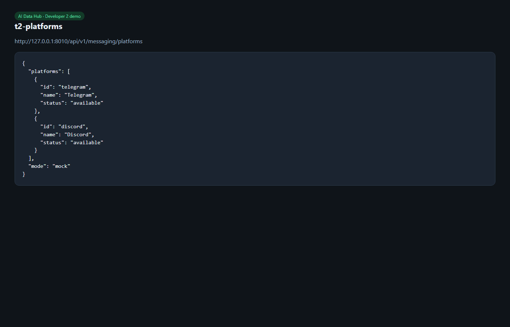

# T2 — Adapter interfaces + offline mock mode

**Date:** 2026-08-18  
**Owner:** Developer 2  
**Status:** Done

## What shipped

Mock facades Dev1 can call with no API keys:

- `AgentService.run`
- `MessagingService.list_platforms` / `connect`
- `AuthConnector.authorize` / `callback` / `refresh` (credential refs only — no tokens)
- `MCPService.list_catalog` / `register` / `list_tools` / `invoke`
- `MemoryService.store` / `search` / `recall` / `update` / `delete`
- `LLMService.chat` / `stream`
- `ContextBuilder.build`
- `KnowledgeService.search` (stub)

Thin HTTP: `GET /messaging/platforms`, `POST /messaging/{platform}/connect`, memories CRUD. No `app.adapters` imports in `app/api/`.

## How we verified

```powershell
cd backend
pytest -q
```

22 tests later include these contracts (suite grew with T3). Connect responses contain `credentialRef`, never `accessToken`.

## Demo

Messaging platforms (mock):



OpenAPI still shows messaging + memories + agents under `/docs` (see T1 screenshot, health/messaging groups).

## URLs

- http://localhost:8000/api/v1/messaging/platforms
- `POST /api/v1/messaging/telegram/connect`
- `POST /api/v1/memories`
- http://localhost:8000/docs
