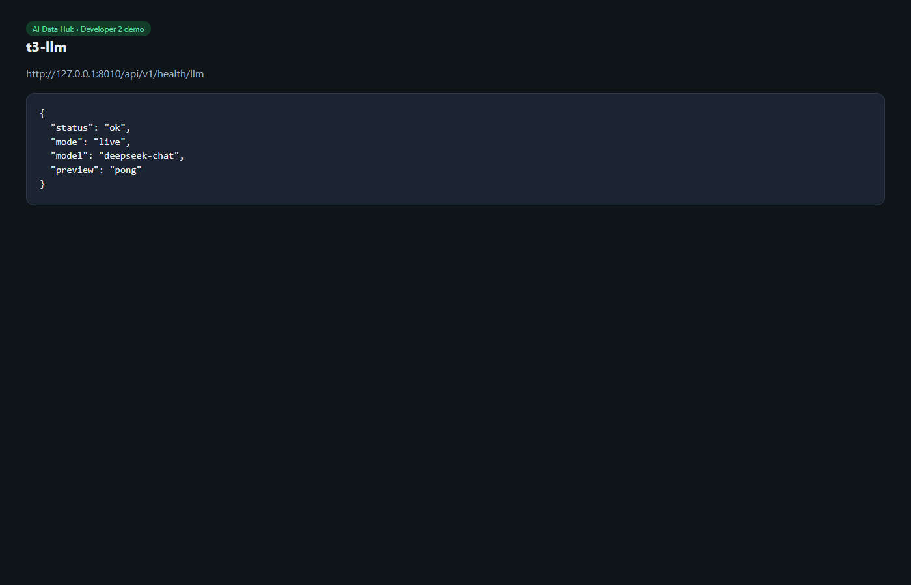

# T3 — LLMService ping (DeepSeek)

**Date:** 2026-08-18  
**Owner:** Developer 2  
**Status:** Done

## Env check (no secrets in this file)

| Check | Result |
|-------|--------|
| `backend/.env` exists | Yes |
| `DEEPSEEK_API_KEY` set | Yes |
| Prefix looks like a DeepSeek key (`sk-…`) | Yes |
| Length | 35 characters (expected shape) |
| `backend/.env` gitignored | Yes (`backend/.gitignore`) |
| Key removed from `backend/.env.example` | Yes — example file is a placeholder only |

**Do not paste the key in chat or in `.env.example`.** `.env.example` is committed; `.env` is not.

If the key was ever in `.env.example` or in a chat, rotate it in the DeepSeek console and put the new value only in `backend/.env`.

## Re-test (2026-08-18)

```powershell
cd backend
pytest -q
python scripts/ping_llm.py
curl http://127.0.0.1:8010/api/v1/health/llm
```

| Check | Result |
|-------|--------|
| pytest | **22 passed** |
| `scripts/ping_llm.py` | `LLM live: ok` · model `deepseek-chat` · preview `pong` |
| `GET /api/v1/health/llm` (local API with `.env`) | `"mode": "live"`, `"preview": "pong"` |
| Response contains API key | No |

Docker Compose API uses `.env.example`, so `http://localhost:8000/api/v1/health/llm` stays **mock** unless you pass the key into Compose. Local `backend/.env` is what makes live ping work.

## Demo

Live DeepSeek ping (key not shown):



**Model update (same day):** `LLM_DEEPSEEK_MODEL=deepseek-v4-pro`. Re-ping: `LLM live: ok` · `model: deepseek-v4-pro` · `preview: pong`.

OpenAPI includes `GET /api/v1/health/llm`:


## Done when

Harness and AstrBot can share `LLMService` / `DEEPSEEK_API_KEY` via env. Routers call `llm_service.ping()` only — they never import the DeepSeek client.
