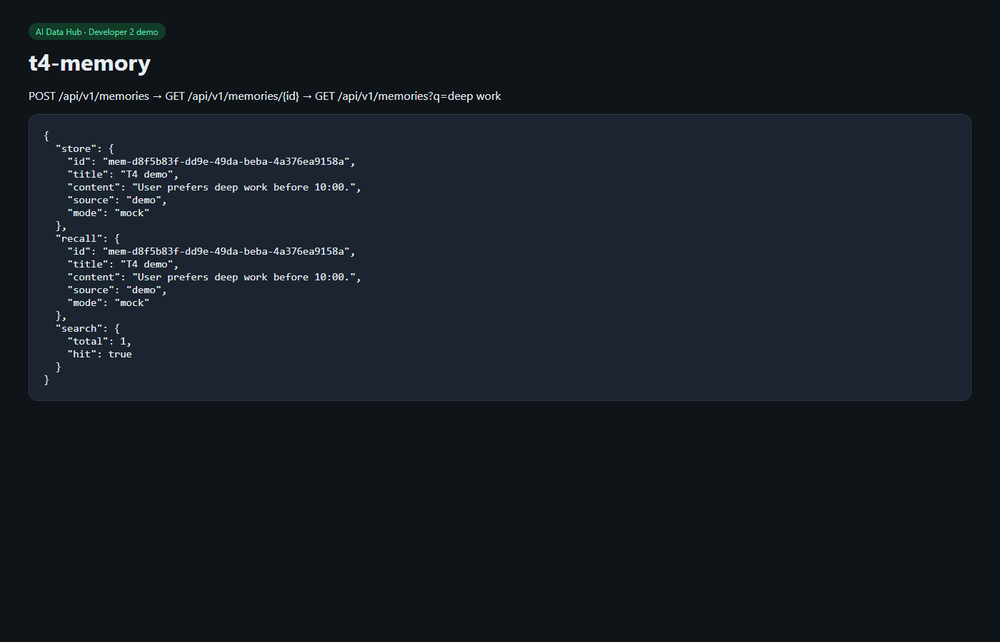

# T4 — MemoryService store / recall

**Date:** 2026-08-18  
**Owner:** Developer 2  
**Status:** Done

## What shipped

`MemoryService` store / search / recall / update / delete.

- **Default:** in-process mock (`MEMORY_MODE=mock`) — no Tencent credentials required
- **Live path:** `TencentMemoryClient` HTTP to `MEMORY_SERVICE_URL` when `MEMORY_MODE=live`
- Compose `memory` sidecar now has a Tencent-shaped mock API (`mock_memory.py`)
- HTTP: `POST/GET/PATCH/DELETE /memories`, `GET /memories?q=`

Postgres UI mapping stays Dev1. No Goal tables invented.

## How we verified

```powershell
cd backend
pytest -q
python scripts/smoke_memory.py
```

| Check | Result |
|-------|--------|
| pytest | **24 passed** |
| smoke | `MEMORY mock: ok` · recall of stored fact |

## Demo

Store → recall → search:



## URLs

- `POST /api/v1/memories` `{ "title", "content", "source?" }`
- `GET /api/v1/memories/{id}`
- `GET /api/v1/memories?q=deep+work`

## Notes

Tencent Cloud Agent Memory credentials were not required. Set `MEMORY_MODE=live` and point `MEMORY_SERVICE_URL` at a real TencentDB (or the Compose mock on `:8081`) when those secrets exist — do not paste them in chat.
