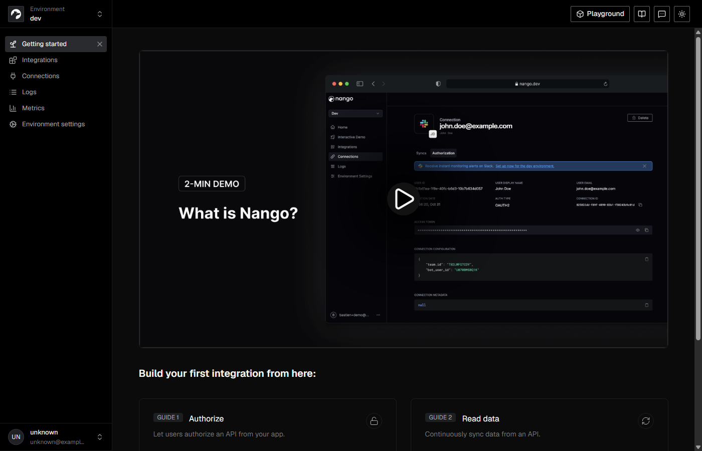

# T5 — AuthConnector + live Nango Connect

**Date:** 2026-08-18  
**Owner:** Developer 2  
**Status:** Done (against **real** `nangohq/nango-server`, not a mock consent page)

## What shipped

`AuthConnector.authorize` → Nango `POST /connect/sessions` → Connect UI URL on `:3009`.

- No OAuth access tokens in the JSON (only `authorizationUrl` + `state`)
- `POST /api/v1/integrations/connect` calls `AuthConnector` (Dev1 can keep using this route)
- Secret lives in `backend/.env` as `NANGO_SECRET_KEY` (gitignored). Bootstrap: `python scripts/bootstrap_nango_secret.py`

## How we verified

```powershell
python scripts/bootstrap_nango_secret.py
pytest tests/test_nango_live.py -q
# POST /api/v1/integrations/connect  {"integrationId":"github"}
```

| Check | Result |
|-------|--------|
| Live pytest | **passed** (`mode: live`) |
| API connect | `authorizationUrl` starts with `http://localhost:3009/?session_token=` |
| Tokens in body | none |
| Nango dashboard | http://localhost:3003 (dev environment) |

Completing GitHub OAuth still needs a GitHub OAuth app in the Nango **Integrations** tab. T5 is the Connect URL from the local Nango server.

## Demo

Live Nango dashboard:



Connect response (token redacted):

```json
{
  "authorizationUrl": "http://localhost:3009/?session_token=<redacted>",
  "state": "<redacted>"
}
```
