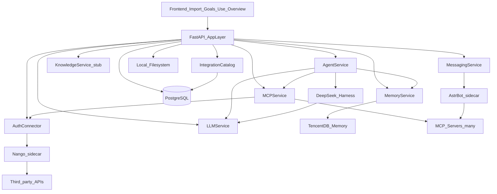

# AI Data Hub — 5-Day Backend Plan + Team Guidelines (Revised)

## Planning baseline

- **Current context (authoritative for scope):** self-hosted single-customer product; 4 UI pages; collaboration/social **out of scope**; modular monolith; 5-day vertical slice.
    
- **Boss requirements (must be in the system):** **DeepSeek Harness**, **AstrBot**, and a path to add a **huge number of MCP/integrations** with good UX (≈2–3 clicks to connect).
    
- **Product Orientation Guide:** baseline concepts only. Prototype layouts must **not** become hard DB/API constraints. Collaboration matching is **removed**.
    
- **Frontend today:** mock SPA in [V2.3.2](d:\Office\AI Data Hub\AI-Datahub\github\v2\V2.3.2). Domain shapes in `[src/shared/js/app-runtime.js](d:\Office\AI Data Hub\AI-Datahub\github\v2\V2.3.2\src\shared\js\app-runtime.js)`. Design contracts from those mocks + screenshots.
    

## Locked role split (prevents duplicate agent work)

|   |   |   |   |
|---|---|---|---|
|Component|Product role|UX value|Dev ease|
|**DeepSeek Harness**|**Primary agent runtime** for Goals analysis, Use missions, tool-using runs|Reliable multi-step reasoning; session log; plugin tools|Single `AgentService` API; Harness is a sidecar|
|**AstrBot**|**Messaging / IM + platform connectors** (Telegram, Discord, etc.) and AstrBot-hosted MCP/plugins for those channels|Users connect chat platforms quickly; inbound messages become authorized sources|Separate `MessagingService` / `AstrBotAdapter`; no product agent loop inside AstrBot|
|**Nango + MCP Manager**|**Scale layer** for hundreds of third-party APIs/OAuth + MCP server catalog/registry/gateway|Import page: search → Connect → OAuth → Done (no JSON editing)|Catalog is data-driven; adding MCP = registry row + Nango provider, not new backend code|
|**TencentDB Agent Memory**|Long-term / chat / fact memory for agents|Use memory drawer + better agent context|`MemoryService` only|
|**PostgreSQL**|App state (goals, tasks, sources, runs, catalog)|Stable UI CRUD|Dev1 owns models|

**Hard rule:** Product business agents always go `API → AgentService → DeepSeek Harness`. AstrBot must **not** become a second Goals/Use brain. Harness must **not** own Telegram/Discord protocol stacks.

## Locked decisions (5-day sprint)

|   |   |
|---|---|
|Area|Decision|
|Repo|**Monorepo**: `backend/` beside frontend|
|App style|**Modular monolith** (FastAPI) + **sidecars** in Compose|
|App DB|**PostgreSQL**|
|Memory|**TencentDB Agent Memory** behind `MemoryService`|
|Agent|**DeepSeek Harness** behind `AgentService` (+ FallbackLoopAdapter if blocked)|
|Messaging / IM MCP|**AstrBot** behind `MessagingService` / `AstrBotAdapter` (sidecar)|
|Huge MCP / OAuth|**Nango** (self-host) behind `AuthConnector` + **MCP Manager** (catalog, registry, gateway)|
|LLM|**DeepSeek** via `LLMService`|
|Files|Local FS via `StorageService`|
|Jobs|Lightweight asyncio workers|
|Auth|Single-user JWT admin|
|RAG|Interface + stub only|
|Collaboration|Not implemented|

## License / packaging notes (do not hide)

|   |   |   |
|---|---|---|
|Component|License|Packaging note|
|DeepSeek Harness|MIT|OK for commercial redistribution|
|TencentDB Agent Memory|MIT|OK|
|AstrBot|**AGPL-3.0**|Boss-required. Run as **isolated sidecar** (HTTP API only). Legal must sign off before shipping commercial images that redistribute AstrBot source obligations. Document in `docs/licenses.md`.|
|Nango|**Elastic License**|Self-host free with limited features; Cloud/EE for full set. Boss-required for scale. Isolate as sidecar; validate EE vs free feature set before production packaging.|

Isolation (sidecars + adapters) keeps FastAPI core replaceable and makes AGPL/Elastic boundaries clearer for counsel.

## Architecture (revised)



### MCP scale design (huge catalog, easy UX)

**User journey (Import page):**

1. Search catalog (Notion, Calendar, GitHub, … + messaging via AstrBot).
    
2. Click **Connect**.
    
3. Nango (or AstrBot for IM) runs OAuth / API-key / bot-token flow.
    
4. System stores **credential reference** only; registers MCP server / tools in **MCP Registry**.
    
5. Source card shows Connected / Syncing / Needs attention.
    
6. Harness agents call tools only through `MCPService` (never see secrets).
    

**Internal components:**

|   |   |
|---|---|
|Piece|Responsibility|
|`integrations_catalog`|Searchable metadata: name, category, logos, auth_type (`nango` \| `astrbot` \| `mcp_url` \| `api_key`), nango_provider_key, mcp_template|
|`AuthConnector`|Start/finish OAuth; refresh tokens via Nango|
|`MCPRegistry`|CRUD of MCP server endpoints, tool schemas, health, enabled scopes|
|`MCPGateway`|Route `invoke(tool, args)` to correct server; inject credentials; audit|
|`MCPService`|Facade used by AgentService / APIs|

**Adding a new MCP later (dev-friendly):**

1. Insert catalog row (or JSON seed).
    
2. Map Nango provider **or** AstrBot platform **or** raw MCP URL template.
    
3. No FastAPI business-logic change if templates cover auth + tool discovery.
    

Day 5 does **not** need 900 live connectors — it needs the **pipeline** that can grow to that without rewriting the app.

### AstrBot vs Harness (boss-aligned)

- **Harness:** Goals propose/plan, Use mission orchestration, tool calls to MCPGateway, session events → `agent_runs`.
    
- **AstrBot:** Connect Telegram/Discord/etc.; expose authorized message/history as Import sources; optional AstrBot MCP plugins registered into MCPRegistry; health + connect APIs only.
    
- Shared: both may use the same `LLMService` config via env, but product features never call AstrBot for “run goal agent”.
    

## Vertical slice (Definition of Done for Day 5)

1. Auth as local admin.
    
2. **Import:** catalog search + Connect for **at least one Nango-backed** (or Nango-simulated) source **and** **at least one AstrBot messaging** connector (can be mock/dev mode if tokens missing).
    
3. Connected source appears in Postgres + MCPRegistry (even if tools are stubbed).
    
4. Create **goal**; store **memory**; recall via TencentDB.
    
5. **AgentService → DeepSeek Harness** run with Context Builder (goal + memory + allowed MCP tools).
    
6. Persist run + task update; Overview activity shows it.
    
7. Compose brings up: `api`, `postgres`, `tencentdb` (or memory stub), `harness`, `astrbot`, `nango` (or nango-mock).
    
8. No direct TD/Harness/AstrBot/Nango/LLM calls from routers.
    

Out of DoD: full 900 Nango providers live, production AGPL legal packaging, full Use mission UI parity, RAG, collaboration.

## Repository structure (revised)

```text
AI-Datahub/
  frontend/                    # existing V2.3.2 tree
  backend/
    app/
      main.py
      api/
        auth.py goals.py tasks.py sources.py
        integrations.py        # catalog search + connect start/callback
        memories.py agents.py overview.py messaging.py health.py
      core/
      models/
      schemas/                 # SHARED contracts
      services/
        agent_service.py
        messaging_service.py
        memory_service.py
        mcp_service.py
        auth_connector.py
        context_builder.py
        ...
      adapters/
        memory_tencent/
        agent_harness/
        astrbot/
        nango/
        mcp_gateway/
        llm_deepseek/
        storage_fs/
        knowledge_stub/
      workers/
    alembic/
    tests/
    scripts/
    pyproject.toml
    .env.example
  docs/
    architecture.md
    api-contracts.md
    open-decisions.md
    licenses.md              # AGPL AstrBot + Elastic Nango
    mcp-catalog.md           # how to add a connector
    cursor/
      DEV1.md DEV2.md AGENTS.md
  docker-compose.yml         # api + postgres + memory + harness + astrbot + nango
  CONTRIBUTING.md
```

## Shared contracts

### Naming / errors

- Plural resources under `/api/v1/...`
    
- UUID IDs (not goal titles as PK)
    
- Enums `snake_case`
    
- Errors: `{ "error": { "code", "message", "details" } }`
    

### Extra tables for scale UX

- `integrations_catalog` — searchable catalog
    
- `integration_connections` — user connections, status, auth_provider (`nango`|`astrbot`|`manual`), external_connection_id
    
- `mcp_servers`, `mcp_tools` — registry
    
- `mcp_audit_events` — basic tool invoke audit
    
- existing: users, goals, subgoals, tasks, data_sources, memories, agent_runs, activity_events
    

### Service interfaces

```text
AgentService.run(...)              # → DeepSeek Harness
MessagingService.connect/list/...  # → AstrBot
AuthConnector.authorize/callback/refresh  # → Nango
MCPService.list_catalog/register/list_tools/invoke
MemoryService.store/search/recall/update/delete
LLMService.chat/stream
KnowledgeService.search  # stub
ContextBuilder.build(...)
```

### Key APIs (priority)

1. Auth login / me
    
2. Goals + tasks CRUD
    
3. `GET /integrations/catalog?q=&category=`
    
4. `POST /integrations/{key}/connect` → redirect/URL from Nango or AstrBot
    
5. `POST /integrations/callback/...` (provider-specific)
    
6. Sources list/sync status (backed by connections)
    
7. Memories CRUD
    
8. `POST /agent/runs`
    
9. `GET /overview`
    
10. `GET /messaging/platforms`, `POST /messaging/{platform}/connect`
    

## Developer split (revised)

### Developer 1 — Core Platform + Catalog UX APIs

Owns: auth, goals, tasks, overview, calendar, `integrations` catalog/connect **API surface**, Postgres models/migrations for catalog+connections+sources, seed catalog entries matching Import UI filters.

Does **not** implement Nango/AstrBot/Harness SDKs (calls `AuthConnector` / `MessagingService` / `MCPService` interfaces).

### Developer 2 — AI + Sidecars (Harness, AstrBot, Nango, MCP Gateway, Memory)

Owns: adapters for Harness, AstrBot, Nango, MCP gateway/registry, TencentDB, LLM, ContextBuilder, AgentService, MessagingService, AuthConnector, Compose sidecar wiring, fake/mock modes for offline demos.

Does **not** invent parallel Goal schemas.

### Merge rule

- `schemas/` day-owner; morning rebase; no force-push to `main`.
    
- Branches: `dev1/goals-catalog`, `dev2/harness-astrbot-nango`.
    

## Five-day schedule (revised)

### Day 1 — Contracts + Compose skeleton

- Backend skeleton + shared schemas including catalog/MCP/connection.
    
- Compose files for postgres, harness, astrbot, nango (or nango-mock), memory.
    
- Auth + health; `docs/licenses.md` + role diagram.
    
- Freeze OpenAPI noon.
    

### Day 2 — CRUD + sidecar boots

- Dev1: Goals/Tasks/Sources + catalog list/search seed (12 demo + messaging entries).
    
- Dev2: LLM ping; TencentDB smoke; Harness health; AstrBot health; Nango (or mock) AuthConnector.start_oauth stub returning connect URL.
    

### Day 3 — Vertical AI + connect path

- Dev2: ContextBuilder + AgentService→Harness; MCPGateway invoke stub; register tools from one connection.
    
- Dev1: Overview activity; Import connect API wired to AuthConnector; connection status on source cards.
    
- Test: connect stub → memory → agent run → activity.
    

### Day 4 — AstrBot messaging + scale path + harden

- Dev2: AstrBot connect flow for one platform (dev/mock OK); register as MCP/source; confirmation flags on high-impact tools.
    
- Dev1: error format; revoke connection; catalog categories aligned to UI.
    
- Document “add a new MCP in 3 steps” in `docs/mcp-catalog.md`.
    
- Bulk-register script: load N MCP definitions from JSON into registry (proves scale model).
    

### Day 5 — Demo + freeze

- Full smoke: catalog search → connect → goal → memory → Harness run → Overview.
    
- Show messaging connector card (AstrBot).
    
- Optional: frontend Goals list via API.
    
- Record open packaging decisions (AGPL/Elastic) for boss/legal.
    

## Cursor guidelines (updated)

1. Read `docs/api-contracts.md`, `docs/licenses.md`, schemas first.
    
2. **Harness only** via `AgentService`; **AstrBot only** via `MessagingService`; **Nango only** via `AuthConnector`.
    
3. Never implement a second agent loop in AstrBot for Goals/Use.
    
4. Never put OAuth tokens in agent prompts or frontend.
    
5. Adding connectors = catalog/registry data, not copy-paste routers.
    
6. Path allowlists in DEV1.md / DEV2.md.
    
7. FallbackLoopAdapter allowed if Harness blocked — same `AgentService` interface.
    
8. Do not remove AstrBot/Nango from Compose to “simplify” without updating docs and boss-facing architecture.
    
9. No collaboration endpoints.
    
10. Conventional commits with scopes: `feat(catalog)`, `feat(harness)`, `feat(astrbot)`, `feat(nango)`, `feat(mcp)`.
    

### Cursor rules to create

- `backend-contracts.mdc`
    
- `backend-dev1.mdc`
    
- `backend-dev2.mdc`
    
- `sidecar-boundaries.mdc` — Harness / AstrBot / Nango isolation rules
    

## Testing strategy

- Unit: schemas, ContextBuilder, catalog search.
    
- Integration: connect mock → registry row; agent run persists.
    
- Smoke: `scripts/smoke_vertical_slice.py` includes catalog connect + Harness + memory.
    
- Optional: Compose profile `demo` with all sidecars.
    

## Risk mitigations (revised)

|   |   |
|---|---|
|Risk|Mitigation|
|Harness preview break|FallbackLoopAdapter behind AgentService|
|AstrBot AGPL|Sidecar isolation + licenses.md; legal before commercial ship|
|Nango Elastic / limited free|AuthConnector + nango-mock mode; EE decision tracked as open packaging item|
|Overlap Harness↔AstrBot|Locked role split; Cursor rule enforcement|
|Huge MCP overwhelm sprint|Scale **pipeline** + JSON bulk-register; not 900 live OAuth apps|
|Two agents edit schemas|Day-owner for schemas/|
|UX still needs JSON|Catalog Connect API forbids manual MCP JSON in UI path|

## Open decisions (narrowed)

Still open (packaging / production), **not** whether to include components:

1. Nango free self-host vs paid EE for full 900+ providers in customer images.
    
2. AstrBot AGPL compliance process for commercial distribution.
    
3. Exact MCP gateway (in-process Day 5 vs dedicated process later).
    
4. RAG (Qdrant + LlamaIndex) post-sprint.
    
5. Whether TencentDB alone is enough vs Postgres `memories` mapping (keep dual: Postgres UI + TD recall).
    
6. VPS sizing with sidecars: estimate **4 vCPU / 16 GB RAM / 60+ GB** when Harness + AstrBot + Nango + Postgres + Memory all run locally; validate on demo hardware.
    

## Deliverables checklist

- Architecture with Harness + AstrBot + Nango/MCP Manager roles
    
- `docs/licenses.md` and `docs/mcp-catalog.md`
    
- Compose sidecars wired (real or mock)
    
- Shared schemas + OpenAPI
    
- Dev1: auth, goals, tasks, catalog/connect APIs, overview
    
- Dev2: Memory, LLM, Agent(Harness), Messaging(AstrBot), AuthConnector(Nango), MCP gateway
    
- Bulk MCP register script
    
- Vertical-slice smoke green
    
- Cursor/DEV guidelines
    

## What not to do in 5 days

- Microservices sprawl beyond sidecars
    
- Multi-tenant SaaS
    
- Collaboration/social
    
- Implementing all Nango providers live
    
- Redesigning the four UI pages
    
- Using AstrBot as the primary Goals/Use agent runtime
    
- Asking users to edit raw MCP JSON for normal connects